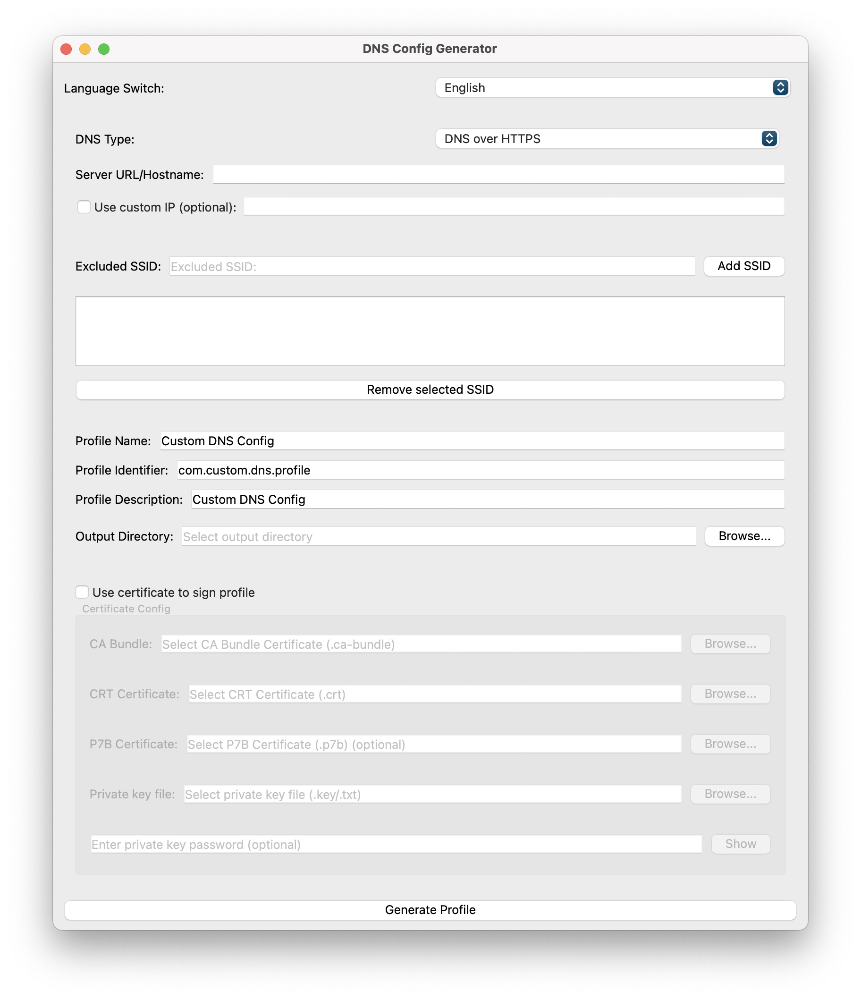

[繁體中文](README.md) | [English](README.en.md) | [日本語](README.ja.md)

---

# DNS Mobileconfig Profile Generator

[](LICENSE)
[](https://codeium.com)
[](https://www.riverbankcomputing.com/software/pyqt/)

> 🤖 This code is generated by AI

## Project Introduction

This is a graphical tool for generating Apple DNS .mobileconfig configuration files. Supports DNS over HTTPS (DoH), DNS over TLS (DoT), and DNS over HTTPS/3 configurations with multiple customization options and certificate signing capabilities.

## ✨ Features

- 🌐 Support multiple DNS protocols:
- DNS over HTTPS (DoH)
- DNS over TLS (DoT)
- DNS over HTTPS/3
- 🔧 Optionally add custom IP address of the server
- 📱 Support adding a list of SSIDs to be excluded (do not use this DNS configuration under the specified WiFi network)
- 🎨 Modern GUI built with PyQt6
- 📄 Generate standard Apple .mobileconfig configuration file
- 🔐 Full certificate signing support:
- CA Bundle Certificate (.ca-bundle)
- CRT Certificate (.crt)
- P7B certificate (.p7b, optional)
- Private key file (.key/.txt)
- Support encrypted private keys



## 🛠️ Installation Requirements

### Environmental requirements
- Python 3.6 or higher
- pip (Python package manager)

### Installation Steps

1. Clone this repository:
```bash
git clone https://github.com/yourusername/dns-mobileconfig-generator.git
cd dns-mobileconfig-generator
```

2. Install dependency packages:
```bash
pip install -r requirements.txt
```

## 📖 How to use

1. Run the program:
```bash
python dns_config_generator.py
```

2. Configure in the graphical interface:

### DNS settings
- Select the DNS type (DoH, DoT, or DoH3)
- Enter the server URL or hostname
- Optional: Add a custom IP address for your server

### SSID Exclusion
- Enter the name of the WiFi network to be excluded
- Click Add SSID to add it to the list
- Added SSIDs can be selected and deleted

### Configuration file information
- Set the profile name
- Set the profile identifier
- Added configuration file description
- Select output directory

### Certificate Signature (optional)
- Select the "Use certificate to sign profile" option
- Select the required certificate file:
- CA Bundle Certificate (Required)
- CRT certificate (required)
- P7B certificate (optional)
- Private key file (required)
- Enter the private key password (if any)

3. Click the "Generate Configuration File" button to generate the .mobileconfig file

## 📱 Install on iOS/iPadOS devices

The generated .mobileconfig file can be installed via:
- Send to device via AirDrop
- Send to device via email
- Download to device via Safari

## ⚠️ Notes

- Certificate passwords are cleared from memory immediately after use
- Signed certificates are recommended for use in enterprise environments
- Please ensure the validity and security of the certificate
- It is recommended to use a certificate issued by a trusted certificate authority (CA)

## 🤝 Contribution Guidelines

Feel free to submit Pull Requests to improve this project! Here are the steps to contribute:

1. Fork this repository
2. Create your feature branch (`git checkout -b feature/AmazingFeature`)
3. Commit your changes (`git commit -m 'Added some cool features'`)
4. Push to the branch (`git push origin feature/AmazingFeature`)
5. Open a Pull Request

## 📜 License

This project is licensed under the MIT License - see the [LICENSE](LICENSE) file for details

## 🔍 Technical Notes

The following main technologies were used in this project:
- PyQt6: for building graphical user interfaces
- plistlib: used to generate Apple configuration files
- Python standard library: for file operations and system functions

## 👥 Acknowledgements

- Thanks to [Codeium](https://codeium.com) for AI-assisted development support
- Thanks to all the developers who contributed to this project

## 📬 Contact

If you have any questions or suggestions, please:
- Submit [Issue](https://github.com/yourusername/dns-mobileconfig-generator/issues)
