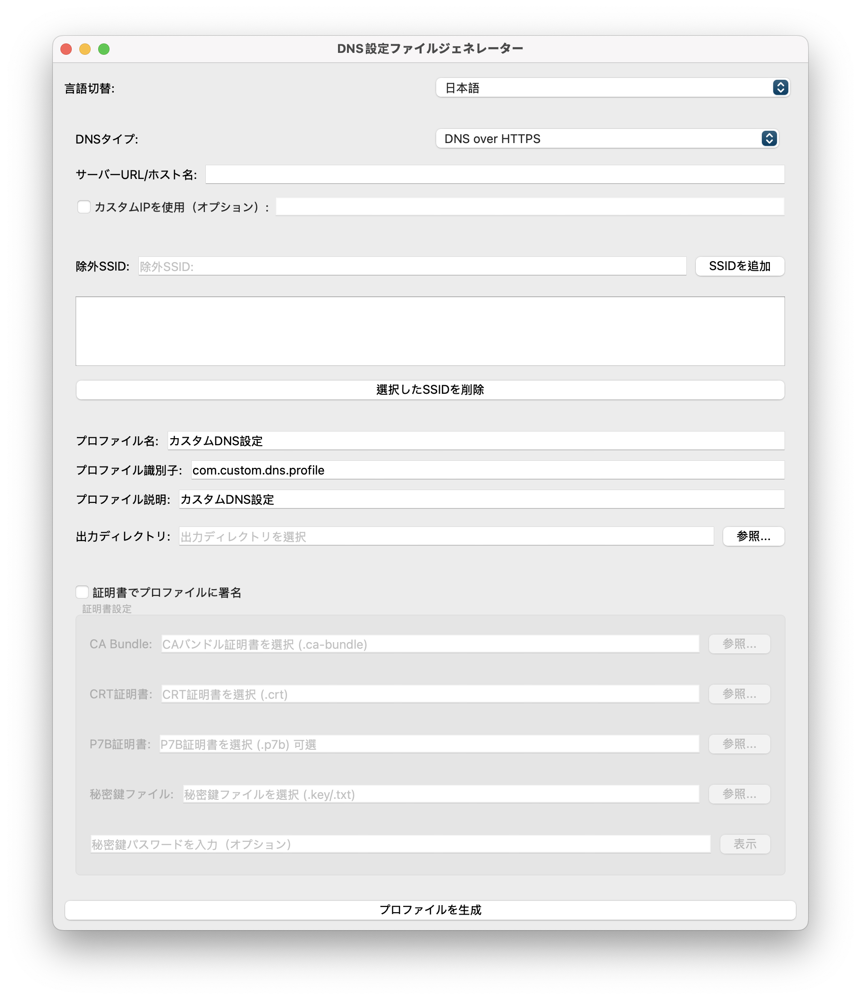

[繁體中文](README.md) | [English](README.en.md) | [日本語](README.ja.md)

---

# DNS Mobileconfig プロファイルジェネレーター

[](ライセンス)
[](https://codeium.com)
[](https://www.riverbankcomputing.com/software/pyqt/)

> 🤖 このコードはAIによって生成されています

## プロジェクトの紹介

これは、Apple DNS .mobileconfig 構成ファイルを生成するためのグラフィカル ツールです。複数のカスタマイズ オプションと証明書署名機能を備えた DNS over HTTPS (DoH)、DNS over TLS (DoT)、および DNS over HTTPS/3 構成をサポートします。

## ✨ 機能

- 🌐 複数の DNS プロトコルをサポート:
- DNS over HTTPS (DoH)
- DNS over TLS (DoT)
- DNS over HTTPS/3
- 🔧 オプションでサーバーのカスタムIPアドレスを追加します
- 📱 除外する SSID のリストの追加をサポート (指定された WiFi ネットワークではこの DNS 構成を使用しないでください)
- 🎨 PyQt6で構築されたモダンなGUI
- 📄 標準の Apple .mobileconfig 構成ファイルを生成する
- 🔐 完全な証明書署名のサポート:
- CA バンドル証明書 (.ca-bundle)
- CRT 証明書 (.crt)
- P7B証明書（.p7b、オプション）
- 秘密鍵ファイル（.key/.txt）
- 暗号化された秘密鍵をサポート



## 🛠️ インストール要件

### 環境要件
- Python 3.6以上
- pip (Python パッケージ マネージャー)

### インストール手順

1. このリポジトリをクローンします。
```バッシュ
git クローン https://github.com/yourusername/dns-mobileconfig-generator.git
cd dns-mobileconfig-generator
「」

2. 依存パッケージをインストールします。
```バッシュ
pip インストール -r 要件.txt
「」

## 📖 使い方

1. プログラムを実行します。
```バッシュ
Python dns_config_generator.py
「」

2. グラフィカルインターフェイスで設定します。

### DNS設定
- DNSタイプ（DoH、DoT、またはDoH3）を選択します
- サーバーのURLまたはホスト名を入力します
- オプション: サーバーのカスタムIPアドレスを追加します

### SSIDの除外
- 除外するWiFiネットワークの名前を入力します
- 「SSIDを追加」をクリックしてリストに追加します
- 追加されたSSIDは選択して削除できます

### 設定ファイル情報
- プロフィール名を設定する
- プロファイル識別子を設定する
- 設定ファイルの説明を追加しました
- 出力ディレクトリを選択

### 証明書署名（オプション）
- 「証明書を使用してプロファイルに署名する」オプションを選択します
- 必要な証明書ファイルを選択します:
- CAバンドル証明書（必須）
- CRT証明書（必須）
- P7B証明書（オプション）
- 秘密鍵ファイル（必須）
- 秘密鍵のパスワードを入力します（ある場合）

3. 「構成ファイルの生成」ボタンをクリックして、.mobileconfigファイルを生成します。

## 📱 iOS/iPadOSデバイスにインストール

生成された .mobileconfig ファイルは、次の方法でインストールできます。
- AirDrop経由でデバイスに送信
- メールで送信
- Safari経由でデバイスにダウンロード

## ⚠️ 注記

- 証明書のパスワードは使用後すぐにメモリから消去されます
- エンタープライズ環境では署名付き証明書の使用が推奨されます
- 証明書の有効性とセキュリティを確認してください
- 信頼できる証明機関（CA）が発行した証明書を使用することをお勧めします。

## 🤝 貢献ガイドライン

このプロジェクトを改善するために、お気軽にプル リクエストを送信してください。貢献するための手順は次のとおりです。

1. このリポジトリをフォークする
2. 機能ブランチを作成します (`git checkout -b feature/AmazingFeature`)
3. 変更をコミットします (`git commit -m 'クールな機能を追加しました'`)
4. ブランチにプッシュする (`git push origin feature/AmazingFeature`)
5. プルリクエストを開く

## 📜 ライセンス

このプロジェクトはMITライセンスの下でライセンスされています - 詳細については[LICENSE](LICENSE)ファイルを参照してください

## 🔍 技術ノート

このプロジェクトでは、主に次の技術が使用されました。
- PyQt6: グラフィカルユーザーインターフェースの構築用
- plistlib: Apple 構成ファイルの生成に使用されます
- Python標準ライブラリ: ファイル操作とシステム関数用

## 👥 謝辞

- AI支援開発サポートを提供してくれた[Codeium](https://codeium.com)に感謝します
- このプロジェクトに貢献してくれたすべての開発者に感謝します

## 📬 お問い合わせ

ご質問やご提案がございましたら、下記までお問い合わせください。
- [Issue](https://github.com/yourusername/dns-mobileconfig-generator/issues) を送信します
