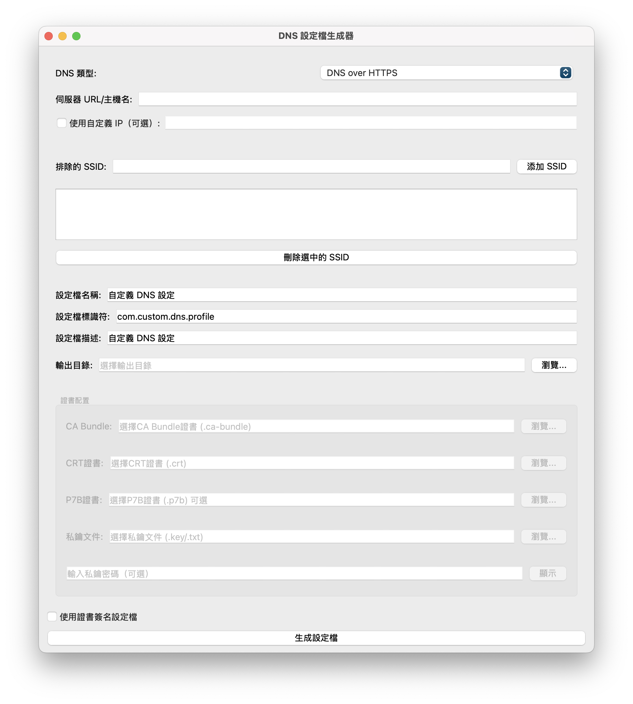

# DNS Mobileconfig 設定檔生成器

[](LICENSE)
[](https://codeium.com)
[](https://www.riverbankcomputing.com/software/pyqt/)

> 🤖 此代碼由 AI 輔助生成

## 專案簡介

這是一個用於生成 Apple DNS .mobileconfig 配置文件的圖形化工具。支持 DNS over HTTPS (DoH)、DNS over TLS (DoT) 和 DNS over HTTPS/3 配置，並提供多種自定義選項和證書簽名功能。

## ✨ 功能特點

- 🌐 支持多種 DNS 協議：
  - DNS over HTTPS (DoH)
  - DNS over TLS (DoT)
  - DNS over HTTPS/3
- 🔧 可選擇性添加伺服器的自定義 IP 地址
- 📱 支持添加需要排除的 SSID 列表（在指定 WiFi 網絡下不使用該 DNS 配置）
- 🎨 使用 PyQt6 構建的現代化圖形界面
- 📄 生成標準的 Apple .mobileconfig 配置文件
- 🔐 完整的證書簽名支持：
  - CA Bundle 證書 (.ca-bundle)
  - CRT 證書 (.crt)
  - P7B 證書 (.p7b，可選)
  - 私鑰文件 (.key/.txt)
  - 支持加密的私鑰



## 🛠️ 安裝要求

### 環境需求
- Python 3.6 或更高版本
- pip（Python 包管理器）

### 安裝步驟

1. 克隆此倉庫：
```bash
git clone https://github.com/MIAONECYAN/DNS-Mobileconfig-Generator.git
cd dns-mobileconfig-generator
```

2. 安裝依賴包：
```bash
pip install -r requirements.txt
```

## 📖 使用方法

1. 運行程序：
```bash
python dns_config_generator.py
```

2. 在圖形界面中配置：

   ### DNS 設定
   - 選擇 DNS 類型（DoH、DoT 或 DoH3）
   - 輸入伺服器 URL 或主機名
   - 可選：添加伺服器的自定義 IP 地址

   ### SSID 排除
   - 輸入需要排除的 WiFi 網絡名稱
   - 點擊「添加 SSID」將其加入列表
   - 可選擇並刪除已添加的 SSID

   ### 配置文件信息
   - 設置配置文件名稱
   - 設置配置文件標識符
   - 添加配置文件描述
   - 選擇輸出目錄

   ### 證書簽名（可選）
   - 選擇「使用證書簽名設定檔」選項
   - 選擇所需的證書文件：
     - CA Bundle 證書（必需）
     - CRT 證書（必需）
     - P7B 證書（可選）
     - 私鑰文件（必需）
   - 輸入私鑰密碼（如果有）

3. 點擊「生成設定檔」按鈕生成 .mobileconfig 文件

## 📱 安裝到 iOS/iPadOS 設備

生成的 .mobileconfig 文件可以通過以下方式安裝：
- 通過 AirDrop 發送到設備
- 通過郵件發送到設備
- 通過 iCloud 下載到設備

## ⚠️ 注意事項

- 證書密碼會在使用後立即從內存中清除
- 建議在企業環境中使用簽名證書
- 請確保證書的有效性和安全性
- 建議使用受信任的證書頒發機構（CA）簽發的證書

## 🤝 貢獻指南

歡迎提交 Pull Requests 來改進這個項目！以下是貢獻步驟：

1. Fork 此倉庫
2. 創建您的特性分支 (`git checkout -b feature/AmazingFeature`)
3. 提交您的更改 (`git commit -m '添加了一些很棒的特性'`)
4. 推送到分支 (`git push origin feature/AmazingFeature`)
5. 開啟一個 Pull Request

## 📜 許可證

本項目採用 MIT 許可證 - 查看 [LICENSE](LICENSE) 文件了解詳情

## 🔍 技術說明

此項目使用了以下主要技術：
- PyQt6：用於構建圖形用戶界面
- plistlib：用於生成 Apple 配置文件
- Python 標準庫：用於文件操作和系統功能

## 👥 致謝

- 感謝 [Codeium](https://codeium.com) 提供的 AI 輔助開發支持
- 感謝所有為此項目做出貢獻的開發者

## 📬 聯繫方式

如果您有任何問題或建議，請：
- 提交 [Issue](https://github.com/MIAONECYAN/DNS-Mobileconfig-Generator/issues)
